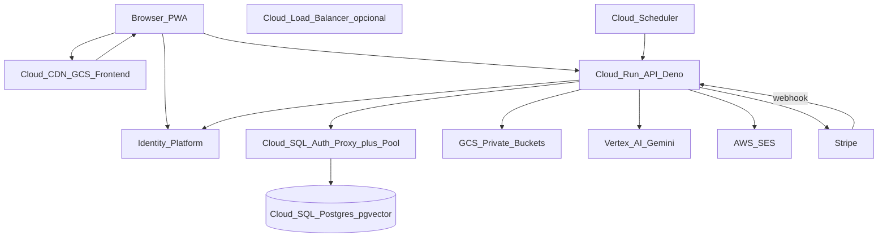

# Plano de Migração Unithery — Supabase + Vercel → GCP

**Status:** STAGING PARCIAL NO AR — Fases 0–1,3,5,6 avançadas; Auth IDP + Storage sync + cutover pendentes
**Status detail:** ver `infra/gcp/STATUS.md`  
**Decisão FE:** GCS + Cloud CDN (travada 2026-08-02)  
**Data:** 2026-08-02  
**Projeto GCP alvo:** `plataforma-therapy-ai`  
**Projeto Supabase origem:** `yfzhjdfvaosezyjvbyid`  
**Orquestração:** Agente 0 (Orquestrador) + especialistas FE / Backend / DBA / IA / QA / Segurança  

Este documento cruza o inventário em [`relatorio-inventario-infraestrutura-unithery.md`](./relatorio-inventario-infraestrutura-unithery.md) com o mapeamento arquitetural pedido e com práticas de mercado (fontes ao final).

---

## 0. Decisões travadas (escopo)

| Origem | Destino GCP | Fica fora |
|--------|-------------|-----------|
| Frontend Vercel | **GCS + Cloud CDN** (alternativa aceita: Firebase Hosting para SPA — ver §6) | — |
| PostgreSQL 15 Supabase | **Cloud SQL for PostgreSQL** (+ pgvector, RLS) | — |
| ~96 Edge Functions Deno | **Cloud Run** (container Deno / API gateway único) | — |
| Supabase Auth | **Identity Platform** | — |
| Supabase Storage (4 buckets) | **GCS** (4 buckets privados espelhados) | — |
| pg_cron | **Cloud Scheduler** → HTTP Cloud Run | — |
| Vertex AI / Gemini | **Permanece** (mesma casa; alinhar região) | — |
| AWS SES | — | **Mantém AWS SES** |
| Stripe | — | **Mantém Stripe** |

---

## 1. Análise do estado atual (As-Is)

### 1.1 Arquitetura real (não só o roadmap antigo)

O `agente-contexto-roadmap.md` ainda cita Claude/OpenAI/Whisper; o código de produção usa **Vertex AI** (`supabase/functions/_shared/vertex.ts`) com `gemini-2.5-pro` e embeddings **768 dims**.

| Camada | Estado | Risco na migração |
|--------|--------|-------------------|
| FE React+Vite PWA | Vercel, domínio `unithery.com` | Baixo (SPA estática) |
| API | 96 functions Deno no Supabase; cota ~100 já forçou consolidação financeira | Alto — redesign de deploy |
| Auth | GoTrue + JWT + `app_metadata` (role, clinic_id, is_solo) + hook SES | Alto — claims + senhas |
| DB | 39 tabelas, RLS, pgvector HNSW, 7 crons, Vault | Alto — dump/restore + RLS |
| Storage | 4 buckets privados + paths no Postgres | Médio — copy + signed URLs |
| IA | Já GCP Vertex | Baixo — ganho de latência |
| SES / Stripe | Externos | Zero migração |

### 1.2 Padrão crítico: quem enforce o multi-tenant?

Hoje a maior parte das Edge Functions usa **service role** (`createServiceClient`) e aplica autorização em código (`authenticateRequest`, `requireClinicOwner`, `assertFinanceAccess`, checagem de `clinic_id`).

As policies RLS (`auth.jwt() → app_metadata`, `is_finance_owner()`, etc.) são **defesa em profundidade**. Elas **não** são o caminho principal das APIs atuais (service role bypassa RLS).

**Implicação para o plano:** no Cloud Run, o padrão natural é manter **DB user privilegiado + authZ na aplicação** (como hoje), e **preservar RLS** para:
- qualquer acesso futuro com role `authenticated`;
- redução de blast radius se alguém conectar com credencial errada;
- testes de isolamento (QA/Segurança).

### 1.3 Inventário resumido (produção)

- **Functions deployadas:** 96  
- **Buckets:** `audio-recordings`, `family-diary-audio`, `pacientes-anexos`, `pacientes-avatars`  
- **Crons:** expire invites, refresh MV, archive audit, diary push, sync Stripe, session email queue, financeiro stale  
- **Domínios financeiros novos:** `financeiro_*` + custos recorrentes  
- **Embeddings:** `patient_embeddings.embedding vector` + índice HNSW; shared usa 768 dims

---

## 2. Arquitetura To-Be (GCP)



### 2.1 Componentes alvo (recomendação concreta)

| Componente | Escolha | Por quê |
|------------|---------|---------|
| Região | **`us-central1`** (igual Vertex atual) | Minimiza latência IA↔API↔DB |
| Frontend | GCS bucket público estático + **Cloud CDN** + Load Balancer HTTPS | Alinha ao pedido; SPA rewrite via LB/CDN |
| Alternativa FE | Firebase Hosting | Mais simples para SPA/PWA; ainda é GCP |
| API | **1 serviço Cloud Run** (router interno por path `/functions/v1/:name` ou `/api/:name`) | Elimina teto de 100 functions; 1 imagem Deno |
| DB | Cloud SQL Postgres **15** Enterprise (ou Enterprise Plus se Managed Pooling) | pgvector suportado; HA regional |
| Pool | Auth Proxy sidecar/connector + **pool client** + Managed Connection Pooling se tier permitir | Evita esgotar `max_connections` |
| Auth | Identity Platform (Firebase Auth enterprise) | Import bcrypt nativo |
| Secrets | Secret Manager | Substitui Supabase secrets / Vault cron |
| Observabilidade | Cloud Logging + Error Reporting + Monitoring | Substitui logs do Dashboard Supabase |
| CI/CD | GitHub Actions → Artifact Registry → Cloud Run / GCS | Extende CI atual |

---

## 3. Estratégia por domínio crítico

### 3.1 Banco + RLS + multi-tenancy (Agente DBA → Backend → Segurança)

**Migração de dados**
1. Inventário de extensions: `vector`, `pgcrypto`, `uuid-ossp` (obrigatórias). `pg_cron`/`pg_net`/`supabase_vault` **não** vão para Cloud SQL — jobs viram Scheduler.
2. Preferência de cutover:
   - **PoC / staging:** `pg_dump` / `pg_restore` (`--no-owner --no-privileges`).
   - **Produção com baixo downtime:** Google **DMS** (logical replication) se rede/fonte permitir; senão dump em janela + freeze de writes.
3. Pós-restore obrigatório:
   - `CREATE EXTENSION vector;`
   - Validar dimensão dos embeddings (`vector_dims(embedding)` = 768)
   - `REINDEX` / rebuild HNSW se necessário
   - `pg_prewarm` em índices quentes (vetor + clinic_id)
   - Comparar counts por tabela + checksums amostrais

**RLS no Cloud SQL — duas camadas**

| Camada | Comportamento |
|--------|----------------|
| **A — Produção Cloud Run (igual hoje)** | Conexão com role `unithery_app` (bypass RLS ou `BYPASSRLS`) + autorização em Deno (`authenticateRequest` + clinic_id) |
| **B — Defesa / futuros clients** | Manter policies; para testes e eventuais queries user-scoped: `BEGIN; SET LOCAL ROLE authenticated; SET LOCAL request.jwt.claims = '...';` |

**Claims no JWT Identity Platform → compatibilidade RLS**

Mapear Custom Claims:

```json
{
  "role": "professional",
  "clinic_id": "uuid",
  "is_solo": true
}
```

Reescrever helpers SQL que leem `auth.jwt() -> 'app_metadata'` para ler claims no topo do JWT **ou** manter um wrapper `auth.jwt()` que unifica as duas formas durante a transição.

**Funções `auth.uid()` / `auth.jwt()` do Supabase:** precisam ser recriadas no Cloud SQL (não existem nativamente). Entrega DBA: migration de compatibilidade.

### 3.2 Vetores / pgvector (Agente DBA + IA)

Fontes: Supabase AI going-to-prod; rivestack pgvector migrate; Google DMS blog.

Checklist:
- Dump **custom format** (`-Fc`) preserva tipos `vector`
- Não usar ferramentas que “stringificam” embeddings
- Após restore: `EXPLAIN ANALYZE` em `search_patient_embeddings` com query real
- Ajustar `ef_search` / memória; HNSW é memory-hungry — dimensionar Cloud SQL com RAM de sobra
- Gate QA: recall e p95 da busca vetorial staging ≈ produção (±10%)

### 3.3 Auth sem reset de senha (Agente Backend + Segurança)

Fontes: [Identity Platform migrating users](https://cloud.google.com/identity-platform/docs/migrating-users), [Firebase Admin importUsers BCRYPT](https://firebase.google.com/docs/auth/admin/import-users).

**Fato:** GoTrue/Supabase guarda senhas em **bcrypt** (`encrypted_password`). Identity Platform **importa BCRYPT** sem parâmetros extras — usuários **não** precisam resetar senha.

Pipeline:
1. Export `auth.users` (+ `auth.identities` se necessário) do Supabase (service role / SQL).
2. Transformar para payload `importUsers`:
   - `uid` = mesmo UUID (preserva FKs `created_by`, etc.)
   - `email`, `emailVerified`
   - `passwordHash` = Buffer do hash bcrypt completo (`$2a$...`; se `$2y$`, normalizar para `$2a$`)
   - `customClaims`: `{ role, clinic_id, is_solo }` a partir de `raw_app_meta_data`
3. Import em lotes (máx. SDK) com `hash: { algorithm: 'BCRYPT' }`.
4. Validar login de amostra por role (master, solo, empregado, família).
5. MFA TOTP: planejar **re-enroll** (fatores TOTP geralmente não migram 1:1) — comunicar usuários MFA.

**Hook de e-mail:** trocar Send Email Hook do Supabase por:
- Identity Platform blocking functions / SMTP custom **ou**
- Cloud Run endpoint que envia via **AWS SES** (manter templates atuais de `auth-send-email`).

### 3.4 Claims no Frontend/Backend

| Hoje (Supabase) | Destino (Identity Platform) |
|-----------------|----------------------------|
| `user.app_metadata.role` | Custom claim `role` |
| `user.app_metadata.clinic_id` | Custom claim `clinic_id` |
| `user.app_metadata.is_solo` | Custom claim `is_solo` |
| `supabase.auth.getSession()` | Firebase JS SDK / Identity Toolkit |
| JWT verificado em Deno com JWKS Supabase | Verificar JWT Google (`iss`, `aud`) + ler claims |

Backend: trocar `authenticateRequest` para validar token Identity Platform; popular o mesmo tipo `AuthenticatedUser`.

Frontend (Agente FE): trocar `@supabase/supabase-js` auth por Firebase Auth SDK; manter TanStack Query / `callFunction` apontando para Cloud Run.

### 3.5 Storage LGPD (Agente Backend + Segurança)

Buckets espelhados (privados, uniform bucket-level access, public access prevention):

| Supabase | GCS |
|----------|-----|
| `audio-recordings` | `unithery-audio-recordings` |
| `family-diary-audio` | `unithery-family-diary-audio` |
| `pacientes-anexos` | `unithery-pacientes-anexos` |
| `pacientes-avatars` | `unithery-pacientes-avatars` |

Controles:
- Sem ACL pública; IAM só para SA do Cloud Run
- **Signed URL V4** TTL curto (5–60 min) gerada no backend após checagem de `clinic_id`/`patient_id`
- Prefixo de objeto: `{clinic_id}/{patient_id}/...` (igual hoje)
- CMEK opcional (fase 2 segurança)
- Logs: **nunca** logar signed URL completa
- Migração: `gcloud storage rsync` / Transfer Service a partir de URLs autenticadas Supabase; dual-write durante cutover

### 3.6 Cloud Run + Deno (Agente Backend)

Fontes: Deno Docker docs; denoland/deno_docker (nota **Cloud Run exige `DENO_DIR=./.deno_cache`**).

Arquitetura alvo:
1. **API Gateway único** em Deno (Oak/Hono/std http) roteando `/v1/:functionName` → handlers existentes em `supabase/functions/*/`.
2. Dockerfile multi-stage + Artifact Registry.
3. Secrets via Secret Manager montados como env.
4. Cloud SQL Connector / Auth Proxy.
5. Concurrency Cloud Run baixa–média + **pool pequeno por instância** (ex. max 5–10 conns) × max instances ≤ orçamento de `max_connections`.

Não criar 96 serviços Cloud Run — isso recria o problema operacional.

### 3.7 Connection pooling (obrigatório)

Fontes: Cloud SQL Managed Connection Pooling docs; DB pooling guides.

| Camada | Ação |
|--------|------|
| Transporte | Cloud SQL Auth Proxy / Node/Deno connector (mTLS/IAM) — **não é pooler** |
| Multiplex | Managed Connection Pooling (Enterprise Plus) **ou** PgBouncer |
| App | Pool global lazy no processo Deno; timeout curto; nunca vazar conexão |

Fórmula: `max_instances × pool_size_por_instancia + headroom < max_connections`.

### 3.8 Scheduler (substitui pg_cron)

| Job atual | Destino |
|-----------|---------|
| `expire_stale_invites` | Scheduler → `POST /internal/cron/expire-invites` |
| `refresh_patient_evolution_weekly` | Scheduler → SQL via job Cloud Run ou Cloud SQL scheduled (avaliar) |
| `archive_old_audit_logs` | Scheduler mensal |
| `check_diary_reminders_daily` | Scheduler → mesmo handler de push |
| `sync_stripe_subscriptions_daily` | Scheduler → Stripe sync |
| `process_session_email_queue` | Scheduler `/15min` → SES queue |
| `financeiro_promover_sessoes_stale` | Scheduler horário |

Auth dos crons: header `X-Cron-Secret` (Secret Manager) — equivalente ao `CRON_SECRET` atual.

### 3.9 Frontend (Agente Frontend)

Pedido: GCS + Cloud CDN.  
**Recomendação prática:**

1. **Fase FE-A (rápida):** Firebase Hosting (CDN Google, rewrite SPA trivial, preview channels).  
2. **Fase FE-B (alinha 100% ao pedido):** migrar origem para GCS + Cloud CDN + LB se precisar de controle fino de cache/WAF.

Build Vite → `dist/` → deploy. Env: `VITE_API_BASE`, Identity Platform config (apiKey, authDomain), VAPID.

PWA: validar service worker + HTTPS no domínio custom.

### 3.10 SES e Stripe (inalterados)

- SES: Cloud Run chama o mesmo `_shared/aws-ses.ts` com secrets AWS no Secret Manager.
- Stripe webhooks: apontar endpoint para Cloud Run (`/stripe-webhook`); atualizar dashboard Stripe no cutover.
- Cron sync Stripe: Scheduler.

---

## 4. Plano faseado (execução futura — gates do Orquestrador)

Ordem de dependência clássica Unithery: **DBA → Backend → Frontend**; IA em paralelo com Backend; **QA + Segurança fecham cada fase**.

### Fase 0 — Fundação GCP (1–2 semanas)
**Lidera:** Orquestrador + DBA + Segurança  

- Projeto `plataforma-therapy-ai`, billing, VPC, região `us-central1`  
- Cloud SQL staging, Artifact Registry, Secret Manager, Logging  
- Terraform/IaC mínimo (recomendado)  
- SA runtime Cloud Run (não a SA do Cursor) com least privilege  

**Gate:** Cloud SQL aceita conexão + pgvector ok; secrets carregáveis.

### Fase 1 — Database staging (1–2 semanas)
**Lidera:** DBA → QA → Segurança  

- Dump/restore staging; extensions; policies RLS; funções `auth.*` compat  
- Rebuild/validate HNSW; benchmarks vetoriais  
- Inventário de objetos Supabase-only a dropar (`pg_cron` jobs, etc.)  

**Gate:** counts + RLS tests (MT-01 clinic A≠B) verdes; busca vetorial OK.

### Fase 2 — Auth Identity Platform (1–2 semanas)
**Lidera:** Backend → FE → Segurança → QA  

- Ativar Identity Platform; import bcrypt dry-run  
- Custom claims; blocking function / e-mail via SES  
- Spike FE login com Firebase SDK  
- Plano MFA re-enroll  

**Gate:** usuários piloto logam sem reset; claims chegam no JWT.

### Fase 3 — API Cloud Run (2–4 semanas)
**Lidera:** Backend → IA → QA  

- Router Deno + Dockerfile (`DENO_DIR=./.deno_cache`)  
- Portar `_shared` (auth JWT Google, supabase client → `postgres.js`/`deno-postgres` ou PostgREST interno)  
- Vertex permanece; SES/Stripe/WebPush  
- Pooling dimensionado  
- Dual-run: Cloud Run staging aponta Cloud SQL staging  

**Gate:** smoke das top 20 functions (create-patient, query-copilot, process-audio, financeiro-*, stripe-webhook, auth flows).

### Fase 4 — Storage GCS (1–2 semanas)
**Lidera:** Backend → Segurança → QA  

- Criar buckets; IAM; signed URLs  
- Migrar objetos staging; dual-write  
- Atualizar paths / hard-delete  

**Gate:** upload/download áudio + anexo + avatar com ACL correta; 403 cross-tenant.

### Fase 5 — Frontend + CDN (1 semana)
**Lidera:** Frontend → QA  

- Deploy SPA; domínio; PWA  
- Trocar clientes Auth + API base URL  
- Feature flags / ambiente  

**Gate:** E2E Playwright críticos verdes contra staging GCP.

### Fase 6 — Scheduler + cutover produção (1–2 semanas)
**Lidera:** Orquestrador + todos  

1. Freeze writes curto (ou DMS catch-up)  
2. Dump/restore ou promote DMS → Cloud SQL prod  
3. Import Auth final (delta users)  
4. Sync Storage final  
5. DNS / tráfego FE + API  
6. Stripe webhook cutover  
7. Desligar crons Supabase  
8. Observabilidade 72h  

**Gate Segurança:** review RLS + signed URLs + audit logs.  
**Gate QA:** matriz aceite (pacote financeiro, 403 empregado, isolamento tenant, regressão agenda/SES, copiloto).  
**Rollback:** DNS de volta + Supabase ainda quente por N dias (decisão: mínimo 14 dias).

### Fase 7 — Decommission Supabase/Vercel (após estabilidade)
- Export backups finais  
- Remover secrets/hooks  
- Cancelar add-ons  
- Atualizar inventário

---

## 5. Matriz de acionamento dos agentes

| Fase | DBA | Backend | Frontend | IA | QA | Segurança |
|------|-----|---------|----------|----|----|-----------|
| 0 Fundação | ● | ○ | ○ | ○ | ○ | ● |
| 1 DB | ● | ○ | — | ● (vetores) | ● | ● |
| 2 Auth | ○ | ● | ● | — | ● | ● |
| 3 Cloud Run | ○ | ● | ○ | ● | ● | ● |
| 4 GCS | ○ | ● | ○ | ○ | ● | ● |
| 5 FE CDN | — | ○ | ● | — | ● | ○ |
| 6 Cutover | ● | ● | ● | ● | ● | ● |

● lidera / ○ apoio

---

## 6. Considerações do arquiteto (opiniões e trade-offs)

### 6.1 O que é “migração integral” de verdade
Não é só “subir Postgres na GCP”. O custo está em: **Auth claims**, **compat RLS**, **96 handlers Deno**, **storage paths**, **crons**, **FE SDK**. Vertex já está feito — o ganho de latência é bônus, não o grosso do trabalho.

### 6.2 Cloud Run: um serviço vs N serviços
**Decisão recomendada:** um serviço (ou no máximo 2: `api` + `workers/cron`).  
96 Cloud Run services aumentam custo operacional e cold starts sem benefício real.

### 6.3 Frontend: GCS+CDN vs Firebase Hosting
Pedido = GCS+CDN. Firebase Hosting é mais barato em esforço para SPA/PWA e continua no ecossistema Google. Sugestão: **Firebase Hosting no cutover**, opcionalmente convergir para GCS+CDN depois — ou ir direto GCS+CDN se quiser zero Firebase Hosting.

### 6.4 AlloyDB vs Cloud SQL
Cloud SQL atende o pedido. AlloyDB só se benchmarks de pgvector/carga justificarem custo.

### 6.5 Realtime Supabase
Se houver dependência real de Realtime, precisa produto substituto (Ably/Pusher ou Firebase RTDB/Firestore) — inventariar uso antes do cutover. Se só “habilitado”, pode ficar fora do MVP da migração.

### 6.6 Custo
Cloud Run + Cloud SQL HA + CDN + Identity Platform tipicamente **≠** fatura Supabase. Fazer TCO antes do Fase 6 com números reais de conexões, storage GB e invocações.

### 6.7 LGPD / saúde
Dados de áudio e embeddings são alto risco. Migrar com:
- buckets privados + signed URLs  
- registro de processamento / DPA GCP  
- logs sem PII  
- soft-delete / hard-delete preservados (`hard-delete-patient`)

---

## 7. Pontos de atenção (failure modes)

1. **Hash bcrypt import mal formatado** → login falha em massa (validar com 10 users antes).  
2. **UID mudando no import** → quebra FKs `created_by` / vínculos.  
3. **RLS helpers `auth.jwt()` quebrados** → falsa sensação de segurança se alguém conectar direto.  
4. **Cloud Run sem pool** → Cloud SQL cai por conexões.  
5. **HNSW cold cache** → latência IA explode no dia 1 (prewarm).  
6. **Dimensão 768 vs schema antigo 1536** → validar antes do dump.  
7. **Stripe webhook URL antiga** → cobranças falham no cutover.  
8. **Send Email Hook** esquecido → signup/reset quebrados.  
9. **MFA TOTP** não migrado → suporte inundado (comunicar).  
10. **Chave SA Cursor vazada no chat** → rotacionar antes de produção.  
11. **Dual-write Storage** incompleto → áudio órfão.  
12. **Cron `financeiro_promover_sessoes_stale`** parado → fila de cobrança stale.

---

## 8. Critérios de aceite da migração (MVP cutover)

1. Login sem reset de senha para amostra multi-role.  
2. Claims `role/clinic_id/is_solo` corretos no JWT.  
3. Isolamento tenant (clinic A não lê clinic B) nas APIs e RLS tests.  
4. Copiloto + embeddings funcionando (p95 aceitável).  
5. Upload/playback áudio sessão + diário família via signed URL.  
6. Financeiro: pacote→saldo, avulso, custos mensais, 403 empregado.  
7. Stripe webhook + sync Scheduler OK.  
8. SES confirmação e lembrete de sessão OK.  
9. Agenda / approve session / payment_prompt OK.  
10. FE PWA em domínio produção via CDN.  
11. Rollback documentado e testado em staging.  
12. Inventário atualizado pós-migração.

---

## 9. Fontes consultadas (≥10)

1. [Google Cloud — Best practices migrating PostgreSQL to Cloud SQL with DMS](https://cloud.google.com/blog/products/databases/best-practices-for-migrating-postgresql-to-cloud-sql-with-dms)  
2. [Supabase Docs — Migrating Postgres](https://supabase.com/docs/guides/platform/migrating-to-supabase/postgres)  
3. [RiveStack — Supabase pgvector alternative / migrate checklist](https://rivestack.io/blog/supabase-pgvector-alternative)  
4. [Supabase Docs — AI Going to Production (HNSW, prewarm)](https://supabase.com/docs/guides/ai/going-to-prod)  
5. [Google Cloud — Identity Platform migrating users (BCRYPT)](https://cloud.google.com/identity-platform/docs/migrating-users)  
6. [Firebase Admin — Import users (BCRYPT)](https://firebase.google.com/docs/auth/admin/import-users)  
7. [Firebase CLI — auth:import / auth:export](https://firebase.google.com/docs/cli/auth)  
8. [Google Cloud — Cloud SQL Managed Connection Pooling (Postgres)](https://cloud.google.com/sql/docs/postgres/managed-connection-pooling)  
9. [Database Connection Pooling — GCP Cloud SQL pooling guide](https://www.database-connection-pooling.com/cloud-database-connection-management/gcp-cloud-sql-connection-pooling/)  
10. [Google Cloud — Cloud SQL manage connections](https://docs.cloud.google.com/sql/docs/mysql/manage-connections)  
11. [Deno Docs — Docker / multi-stage](https://docs.deno.com/runtime/reference/docker/)  
12. [denoland/deno_docker — Cloud Run `DENO_DIR` caveat](https://github.com/denoland/deno_docker)  
13. [Google Cloud — Deploy to Cloud Run](https://cloud.google.com/run/docs/deploying)  
14. [Google Cloud — Signed URLs](https://cloud.google.com/storage/docs/access-control/signed-urls)  
15. [Google Cloud Blog — GCS privacy & security best practices](https://cloud.google.com/blog/products/storage-data-transfer/google-cloud-storage-best-practices-to-help-ensure-data-privacy-and-security)  
16. [Firebase Hosting vs App Hosting / static SPA guidance](https://firebase.blog/posts/2024/05/app-hosting-vs-hosting/)  
17. [PostgREST — JWT claims + RLS (`request.jwt.claims`)](https://postgrest.org/en/stable/explanations/db_authz.html)  
18. Inventário interno Unithery — `docs/relatorio-inventario-infraestrutura-unithery.md`

---

## 10. Próximo passo (após sua aprovação)

Não executar até você autorizar. Ordem sugerida de kickoff:

1. Aprovar este plano + decidir FE: **GCS+CDN direto** vs **Firebase Hosting primeiro**.  
2. Fase 0 IaC no projeto `plataforma-therapy-ai`.  
3. Fase 1 dump staging + validação pgvector.  

Quando aprovar, o Orquestrador abre a Fase 0 com DBA + Segurança.
