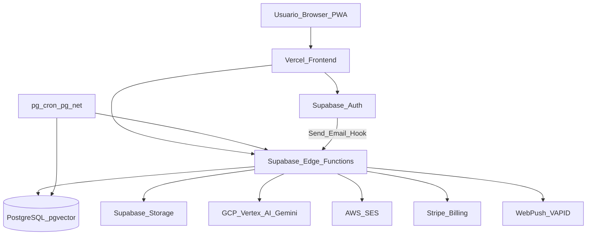

# Relatório de Inventário de Infraestrutura — Unithery

**Data de geração:** 2026-08-01  
**Objetivo:** mapa factual do que a plataforma usa e hospeda hoje, para leitura e estudo de eventual migração (ex.: GCP).  
**Escopo:** código do repositório `plataforma-therapy-ia` + estado remoto consultado (Edge Functions deployadas, tabelas, buckets, crons).  
**Não inclui:** valores de secrets/chaves; volumetria de storage/tráfego (não disponível só pelo código).

---

## 1. Resumo executivo

A Unithery é um SaaS multi-tenant (Master → Clínica/Consultório → Profissional → Família) com:

| Camada | Onde está hoje | Observação |
|--------|----------------|------------|
| Frontend (SPA/PWA) | **Vercel** (domínio `unithery.com` / `www.unithery.com`) | Vite + React; rewrite SPA em `vercel.json` |
| Backend API | **Supabase Edge Functions** (Deno) | ~96 functions deployadas no projeto remoto |
| Auth | **Supabase Auth** (GoTrue) | JWT + `app_metadata` (role, clinic_id, is_solo); MFA TOTP habilitável |
| Banco | **PostgreSQL 15** gerenciado pelo Supabase | RLS, `pgvector`, `pg_cron`, Vault |
| Arquivos | **Supabase Storage** | 4 buckets privados em produção |
| E-mail transacional | **AWS SES** | Auth hooks + lembretes de sessão |
| IA (LLM / STT / embeddings / docs) | **Google Cloud Vertex AI (Gemini)** | Service Account; **já é GCP** |
| Billing SaaS | **Stripe** | Checkout, portal, webhooks, sync diário |
| Push | **Web Push (VAPID)** | Edge Function + cron de lembretes |
| CI | **GitHub Actions** | lint, typecheck, unit, e2e, audit |

**Implicação para estudo GCP:** a carga de IA já roda em Vertex (`us-central1` por padrão). O maior bloco a migrar seria Supabase (Postgres + Auth + Storage + Edge Functions Deno) e o frontend Vercel; e-mail já está na AWS SES.

**Projeto Supabase remoto (ref):** `yfzhjdfvaosezyjvbyid`

---

## 2. Diagrama lógico da hospedagem atual

---

## 3. Frontend

### 3.1 Stack
- **Runtime UI:** React 18 + TypeScript
- **Build:** Vite
- **Estilo:** Tailwind CSS
- **Dados client:** TanStack Query
- **Rotas:** React Router
- **PWA:** `vite-plugin-pwa` + Workbox
- **PDF:** `@react-pdf/renderer`
- **Editor:** TipTap (onde aplicável)
- **Cliente Supabase:** `@supabase/supabase-js` (anon key no browser)

### 3.2 Hospedagem
- **Vercel** — SPA com rewrite `/(.*) → /index.html` ([`vercel.json`](../vercel.json))
- Domínios configurados no Auth: `https://www.unithery.com`, `https://unithery.com` ([`supabase/config.toml`](../supabase/config.toml))
- Env públicas típicas: `VITE_SUPABASE_URL`, `VITE_SUPABASE_ANON_KEY`, `VITE_VAPID_PUBLIC_KEY`, flags Stripe

### 3.3 Organização de código (containers)
Módulos em `src/containers/`: `auth`, `landing`, `dashboard`, `patient`, `calendar`, `copilot`, `family`, `financeiro`, `billing`, `paywall`, `settings`, `admin`, `reports`, `pdf`, etc.

### 3.4 Superfícies de produto (rotas principais)
| Rota | Função |
|------|--------|
| `/` | Landing pública |
| `/login`, `/register`, `/auth/confirm`, reset password | Auth |
| `/dashboard` | Dashboard clínico/admin |
| `/patients`, `/patients/:id/:tab` | Lista + prontuário (incl. Financeiro do paciente) |
| `/session/:patientId` | Sessão / evolução |
| `/calendar`, `/agenda` | Agenda do terapeuta |
| `/financeiro` | Honorários / caixa do profissional (solo) |
| `/assinatura` | Gestão da assinatura Unithery (Stripe) |
| `/settings` | Perfil/Configurações |
| `/professionals` | Gestão de terapeutas (clínica) |
| `/family/*` | Portal família (diário, agenda, combinados) |
| `/unithery/teste` | Lab Stripe (functions de teste podem estar desligadas) |

### 3.5 CI/CD frontend
- GitHub Actions [`.github/workflows/ci.yml`](../.github/workflows/ci.yml): lint, typecheck, unit/coverage, Playwright e2e, `npm audit`
- Deploy Vercel: tipicamente por integração Git (não há workflow de deploy Vercel no repo)

---

## 4. Supabase — visão completa

### 4.1 Serviços usados
| Serviço | Uso na Unithery |
|---------|-----------------|
| **Auth** | Cadastro clínica/família/profissional, login, confirmação e-mail, reset senha, MFA TOTP |
| **Postgres** | Fonte de verdade multi-tenant + embeddings |
| **Edge Functions** | Quase toda a API de negócio (não PostgREST direto para domínios sensíveis) |
| **Storage** | Áudios, avatares, anexos |
| **Realtime** | Habilitado no config (uso pontual conforme features) |
| **Vault** | Secret `cron_secret` para crons que invocam Edge |
| **pg_cron / pg_net** | Jobs agendados + HTTP para functions |
| **Dashboard** | Operação, logs, secrets |

### 4.2 Auth (detalhe)
- Provider: e-mail/senha (+ fluxos de convite)
- Claims em `app_metadata`: `role` (`master` \| `clinic_admin` \| `professional` \| `family`), `clinic_id`, `is_solo`
- **Send Email Hook** → Edge Function `auth-send-email` → **AWS SES** (templates Unithery)
- Secret: `SEND_EMAIL_HOOK_SECRET`
- Site URL produção: `https://www.unithery.com`

### 4.3 Banco de dados (produção — 39 tabelas `public`)

**Multi-tenant / identidade**
- `clinics`, `clinic_settings`, `clinic_preferences`, `clinic_admins`, `platform_admins`
- `professionals`, `patients`, `family_members`, `patient_family_links`, `invites`

**Agenda e sessão clínica**
- `therapist_schedule`, `session_notes`, `session_email_jobs`
- `agreements`, `crisis_alerts`, `recomendacoes_salvas`

**Áudio / IA / RAG**
- `audio_recordings`, `audio_transcriptions`, `ai_jobs`, `ai_usage_events`
- `patient_embeddings` (**pgvector**, isolamento por `patient_id`)
- `patient_attachments`, `patient_proactive_summaries`

**Família**
- `diary_entries`, `push_subscriptions`, `push_reminder_log`

**Billing Unithery (Stripe SaaS)**
- `clinic_subscriptions`, `planos`, `plan_addons`, `clinic_addons`, `invoices`

**Financeiro / honorários (Caixa do terapeuta)**
- `financeiro_planos_paciente`, `financeiro_transacoes`, `financeiro_saldos_pacientes`
- `financeiro_sessoes_cobranca`, `financeiro_custos_recorrentes`

**Auditoria / ops**
- `audit_logs`, `audit_logs_archive`
- `professional_dashboard_dismissals`

**Extensões ativas no remoto:** `vector`, `pg_cron`, `pg_net`, `pgcrypto`, `uuid-ossp`, `supabase_vault`, `pg_stat_statements`, `plpgsql`

**Migrations no repo:** ~63 arquivos em `supabase/migrations/`

**RLS:** padrão multi-tenant por `clinic_id` / vínculo profissional-paciente; financeiro com `is_finance_owner()`; storage com policies por bucket.

### 4.4 Storage (buckets em produção)

| Bucket | Público | Limite (remoto) | Conteúdo |
|--------|---------|-----------------|----------|
| `audio-recordings` | não | 150 MB | Áudios de sessão / copiloto |
| `family-diary-audio` | não | 15 MB | Áudio do diário familiar |
| `pacientes-anexos` | não | 15 MB | Anexos do prontuário (RAG) |
| `pacientes-avatars` | não | 5 MB | Foto do paciente |

**Nota:** migration define também `profissionais-avatars`, mas **não aparece** na lista de buckets do remoto no momento do inventário; a function `upload-professional-avatar` existe no código e **não está deployada**.

### 4.5 Crons (`pg_cron`) em produção

| Job | Schedule | Função |
|-----|----------|--------|
| `expire_stale_invites` | `0 * * * *` | Expira convites pendentes |
| `refresh_patient_evolution_weekly` | `15 * * * *` | Refresh MV de evolução |
| `archive_old_audit_logs` | `0 3 1 * *` | Arquiva audit > 6 meses |
| `check_diary_reminders_daily` | `0 21 * * *` | Invoca Edge de lembretes push |
| `sync_stripe_subscriptions_daily` | `0 6 * * *` | Invoca `sync-stripe-subscriptions` |
| `process_session_email_queue` | `*/15 * * * *` | Processa fila SES de sessão |
| `financeiro_promover_sessoes_stale` | `15 * * * *` | Promove cobranças stale / ATRASADO |

### 4.6 Edge Functions

#### Contagem
| Escopo | Qtd |
|--------|-----|
| Pastas no repositório (`supabase/functions/*`, exc. `_shared`) | **105** |
| **Deployadas no projeto remoto** | **96** |
| No código, sem deploy remoto | 9 (ver abaixo) |

#### Functions no código sem deploy remoto (cota / lab)
- `financeiro-confirm-session-payment`, `financeiro-get-patient-ledger`, `financeiro-list-pending-sessions`, `financeiro-reschedule-from-queue` — **lógica consolidada** nas 6 functions `financeiro-*` deployadas
- `stripe-test-*` (4) — lab Stripe; removidas do remoto por cota
- `upload-professional-avatar`

#### Inventário por domínio (deployadas)

**Auth / onboarding / convites**
- `auth-send-email`, `register-clinic`, `register-professional`, `register-family`
- `generate-invite`, `validate-invite`, `preview-invite`, `link-family-account`, `manage-patient-link`

**Pacientes / prontuário**
- `create-patient`, `update-patient`, `list-patients`, `get-patient-record`, `get-archived-patients`, `reactivate-patient`
- `verify-patient-cpf`, `upload-patient-avatar`
- `list-patient-attachments`, `upload-patient-attachment`, `delete-patient-attachment`, `get-patient-attachment-summary`
- `get-patient-crisis-calendar`, `get-patient-scheduled-therapies`, `get-patient-sessions`, `get-patient-artifacts`

**Agenda / sessão**
- `create-schedule`, `get-daily-sessions`, `get-monthly-summary`, `reschedule-session`
- `start-schedule-session`, `complete-schedule-session`
- `approve-session-note`, `reject-session-note`, `save-session-annotations`, `update-report`
- `list-pending-evolutions`, `list-all-reports`, `get-pdf-data`
- `send-session-reminder`, `process-session-email-queue`

**IA / áudio / copiloto**
- `upload-audio`, `process-audio`, `process-session-text`, `transcribe-copilot-audio`
- `process-family-audio`, `submit-family-audio-checkin`
- `query-copilot`, `get-session-recommendations`, `save-recommendation`, `list-saved-recommendations`, `delete-saved-recommendation`
- `generate-report-summary`, `generate-patient-summary`, `generate-proactive-summary`
- `save-ai-artifact`, `update-saved-artifact`, `update-artifact-visibility`, `list-ai-artifact-status`
- `get-professional-morning-briefing`, `process-clinical-return`

**Família / diário / push**
- `submit-diary`, `get-family-calendar-status`, `get-family-clinical-record`
- `get-family-session-detail`, `get-family-session-history`, `get-family-shared-artifacts`
- `create-agreement`, `list-agreements`, `get-latest-agreements`, `toggle-agreement`
- `register-push-subscription`, `check-and-send-reminders`, `clear-alerts`, `dismiss-alert`

**Clínica / settings / dashboard**
- `get-clinic-dashboard`, `get-clinic-settings`, `update-clinic-settings`, `list-professionals`, `update-professional`

**Billing Stripe (assinatura Unithery)**
- `get-paywall-state`, `get-plan-control-state`, `create-stripe-checkout`, `confirm-stripe-checkout`
- `stripe-webhook`, `sync-stripe-subscriptions`, `cancel-subscription`, `list-invoices`
- `purchase-patient-quota-pack`, `process-checkout-bypass`, `purchase-addon-bypass`

**Financeiro (honorários / caixa)**
- `financeiro-get-dashboard`, `financeiro-list-transacoes`, `financeiro-upsert-transacao`, `financeiro-cancel-transacao`
- `financeiro-list-patient-plans`, `financeiro-upsert-patient-plan`  
  (actions consolidadas: ledger, pending sessions, confirm payment, reschedule, custos mensais)

#### Shared libraries relevantes (`supabase/functions/_shared/`)
- `auth.ts`, `supabase.ts`, `cors.ts`, `response.ts`, `errors.ts`
- `vertex.ts` — cliente Vertex/Gemini
- `aws-ses.ts` — SES
- `stripe.ts`, `stripe-billing-config.ts`
- `web-push.ts`, `cron-auth.ts`
- `financeiro.ts`, `paywall.ts`, `plan-quotas.ts`, `session-note-pipeline.ts`, etc.

### 4.7 Limite operacional observado
Plano Supabase com **cap ~100 Edge Functions**. Deploy de functions novas já exigiu consolidação (financeiro) e remoção das `stripe-test-*`.

---

## 5. Google Cloud / Gemini (Vertex AI)

**Importante:** a IA de produção **não** usa Google AI Studio (API key). Usa **Vertex AI** com service account.

| Item | Valor / uso |
|------|-------------|
| Auth | Secret `GCP_SERVICE_ACCOUNT` (JSON SA em base64) |
| Região default | `GCP_LOCATION` = `us-central1` |
| Chat / estruturação | `VERTEX_CHAT_MODEL` default `gemini-2.5-pro` |
| Embeddings | `VERTEX_EMBED_MODEL` default `gemini-embedding-001`, **768 dims** |
| Capacidades | `generateContent`, stream SSE, `predict` embeddings, áudio inline (base64, sem GCS), extração de documentos |
| Consumidores | pipeline de sessão (`process-audio`, `process-session-text`), copiloto (`query-copilot`), diário família, anexos RAG, resumos, briefings |

`.env.example` ainda menciona `OPENAI_API_KEY` / `ANTHROPIC_API_KEY` (legado / fallback potencial no código); o caminho canônico documentado no shared é Vertex.

**Para migração GCP:** este bloco já está em GCP. Avaliar se mantém projeto/região atuais ou unifica com o restante da stack migrada.

---

## 6. AWS

| Serviço | Uso |
|---------|-----|
| **SES** | E-mails de autenticação (`auth-send-email`) e lembretes/confirmações de sessão (`send-session-reminder`, `process-session-email-queue`) |
| Região tipica | `AWS_SES_REGION` (ex. `us-east-1`) |
| Secrets | `AWS_ACCESS_KEY_ID`, `AWS_SECRET_ACCESS_KEY`, `AWS_SES_FROM_EMAIL`, `AWS_SES_FROM_NAME`, `AWS_SES_CONFIGURATION_SET` |

**Não há indício no código de S3 próprio** para mídia clínica — storage é Supabase. Áudio vai para Vertex inline, não para bucket GCS/S3 na pipeline atual.

---

## 7. Stripe

| Uso | Detalhe |
|-----|---------|
| Produto | Assinatura da plataforma Unithery (planos, addons, pacotes de cota) |
| Modes | test / live via secrets e flags |
| Functions | checkout, confirm, webhook, sync, cancel, invoices, paywall state |
| Frontend | `/assinatura`, paywall, lab `/unithery/teste` |
| Cron | sync diário 06:00 UTC |

Separar mentalmente de **Financeiro** (`/financeiro`): honorários de pacientes ≠ Stripe SaaS.

---

## 8. Push notifications

- Web Push padrão (não OneSignal/FCM dedicado no código)
- Secrets: `VAPID_PUBLIC_KEY`, `VAPID_PRIVATE_KEY`, `VAPID_SUBJECT`
- FE: `VITE_VAPID_PUBLIC_KEY`
- Function: `register-push-subscription`, `check-and-send-reminders`
- Cron: `check_diary_reminders_daily`

---

## 9. Secrets / variáveis (somente nomes)

### Frontend (`VITE_*`)
`VITE_SUPABASE_URL`, `VITE_SUPABASE_ANON_KEY`, `VITE_VAPID_PUBLIC_KEY`, `VITE_STRIPE_*`, `VITE_STRIPE_BILLING_ENABLED`

### Edge Functions / Supabase secrets (referenciados no código)
`SUPABASE_URL`, `SUPABASE_ANON_KEY`, `SUPABASE_SERVICE_ROLE_KEY`  
`GCP_SERVICE_ACCOUNT`, `GCP_LOCATION`, `VERTEX_CHAT_MODEL`, `VERTEX_EMBED_MODEL`  
`AWS_ACCESS_KEY_ID`, `AWS_SECRET_ACCESS_KEY`, `AWS_SES_*`  
`SEND_EMAIL_HOOK_SECRET`, `CRON_SECRET`  
`STRIPE_*` (várias chaves test/live/billing/webhook/products)  
`VAPID_*`, `PLATFORM_BILLING_EXEMPT_EMAILS`, `PUBLIC_APP_URL`  
(legado possível) `OPENAI_API_KEY`, `ANTHROPIC_API_KEY`

### Ops local
`DATABASE_URL` (scripts de migration/QA), `ENCRYPTION_KEY` (exemplo)

---

## 10. Funcionalidades de produto × infraestrutura

| Capacidade de negócio | Infra que sustenta |
|----------------------|--------------------|
| Cadastro clínica / login / MFA | Supabase Auth + SES |
| Multi-tenant + RLS | Postgres Supabase |
| Prontuário / anamnese / anexos | Postgres + Storage `pacientes-anexos` + Vertex OCR/extract |
| Agenda e ciclo de sessão | Postgres + Edge + e-mails SES |
| Gravação e evolução por áudio | Storage `audio-recordings` + Vertex (STT/estrutura) + embeddings |
| Copiloto clínico RAG | `patient_embeddings` + Vertex chat/embed |
| Portal família + diário | Edge + Storage áudio família + push |
| Convites familiares | Postgres invites + preview Edge |
| Assinatura Unithery / paywall | Stripe + Postgres billing |
| Honorários / custos fixos | Tabelas `financeiro_*` + Edge consolidadas |
| Dashboard / alertas | Edge + Postgres (+ MV/cron) |
| PDF / relatórios | Edge `get-pdf-data` + FE `@react-pdf/renderer` |
| Landing / marketing site | Vercel |

---

## 11. Lacunas e riscos para um estudo de migração GCP

1. **Supabase é o núcleo operacional** (Auth + DB + Storage + 96 Deno Functions + crons). Migrar implica redesenhar API (Cloud Run / Cloud Functions), Auth (Identity Platform / Firebase Auth / custom), Storage (GCS), jobs (Cloud Scheduler), e reescrever/adaptar Deno→Node/Go.
2. **Cota de Edge Functions** já pressiona arquitetura (consolidação financeira). Em GCP isso muda o modelo de custo/limites.
3. **IA já está em Vertex** — ganho parcial se o restante for para GCP; avaliar latência/região única (`us-central1` vs região do banco).
4. **SES na AWS** — migrar para GCP exigiria SendGrid/Mailgun/Amazon SES mantido ou SMTP terceiro; hoje SES está acoplado ao hook de Auth.
5. **Stripe** permanece externo em qualquer nuvem.
6. **LGPD:** áudios e embeddings são dados sensíveis de saúde — buckets privados + isolamento `patient_id` precisam ser preservados no desenho GCP.
7. **Realtime / PWA / Vercel** — decisão separada (Cloud CDN + Cloud Storage static, ou manter Vercel).
8. **Dimensão de embeddings:** schema histórico citava 1536; shared Vertex usa **768** (`EMBED_DIMS`) — validar consistência em migração de vetores.

---

## 12. Checklist sugerido para a próxima fase do estudo (não é implementação)

- [ ] Exportar métricas Supabase (DB size, storage GB, invocações EF/mês, MAU Auth)
- [ ] Inventariar custos mensais: Supabase + Vercel + AWS SES + Vertex + Stripe fees
- [ ] Mapear 1:1 cada Edge Function → serviço GCP alvo (Cloud Run vs Cloud Functions)
- [ ] Decidir Auth target e impacto no JWT/`app_metadata`/RLS
- [ ] Plano de cutover Storage (copy + dual-write?)
- [ ] Reescrever crons `pg_cron` → Cloud Scheduler + Pub/Sub
- [ ] PoC: uma function crítica (ex. `query-copilot` ou `process-audio`) em Cloud Run apontando ao mesmo Vertex
- [ ] Avaliação se Postgres fica em **Cloud SQL** ou **AlloyDB** + pgvector

---

## 13. Fontes deste relatório

- Código: `supabase/functions/`, `supabase/migrations/`, `src/`, `vercel.json`, `.env.example`, `supabase/config.toml`
- Remoto (consulta 2026-08-01): `supabase functions list`, `pg_tables`, `storage.buckets`, `cron.job`
- Contexto produto: `agente-contexto-roadmap.md` (**atenção:** seção de IA do roadmap está desatualizada vs Vertex atual)

---

*Documento gerado para apoio a decisão. Não altera infraestrutura.*
